<div align="center">


[](https://ibrahim-abdullaziz.vercel.app)

</div>

---

```bash
~ ibrahimabdullaziz $ cat ibrahim.tsx
```

<div align="center">



</div>

---

```bash
~ ibrahimabdullaziz $ npm install ibrahim
```

```
added 1 frontend engineer in 0.3s

  [+] react-19              -- expert
  [+] next-js-14            -- proficient
  [+] typescript            -- proficient
  [+] redux-toolkit         -- proficient
  [+] tanstack-query        -- proficient
  [+] tailwind-v4           -- proficient
  [+] framer-motion         -- comfortable
  [+] c-cpp-foundations     -- strong (yes, really)
```

> My C/C++ background means I understand render cycles,
> memory, and performance at a level most frontend devs skip.

---

```bash
~ ibrahimabdullaziz $ cat roadmap.log
```

```
2026 goal: senior-ready frontend engineer

  react internals    [####################]  90%
  next.js / rsc      [################----]  80%
  typescript deep    [###############-----]  75%
  testing (jest/rtl) [########------------]  40%
  backend (node.js)  [#####---------------]  25%
```

---

```bash
~ ibrahimabdullaziz $ ./stats.sh
```

<div align="center">


<br/><br/>

[](https://github.com/ibrahimabdullaziz)

</div>

---

```bash
~ ibrahimabdullaziz $ ./connect.sh
```

```
  portfolio -> ibrahim-abdullaziz.vercel.app
  linkedin  -> linkedin.com/in/ibrahim-abdullaziz-894035339
  email     -> ibrahimabdullaziz55@gmail.com
  github    -> github.com/ibrahimabdullaziz
```

<div align="center">

[](https://ibrahim-abdullaziz.vercel.app)
[](https://www.linkedin.com/in/ibrahim-abdullaziz-894035339)
[](mailto:ibrahimabdullaziz55@gmail.com)
[](https://github.com/ibrahimabdullaziz)

<br/>

*building UIs that are fast, clean, and built to last.*


</div>
