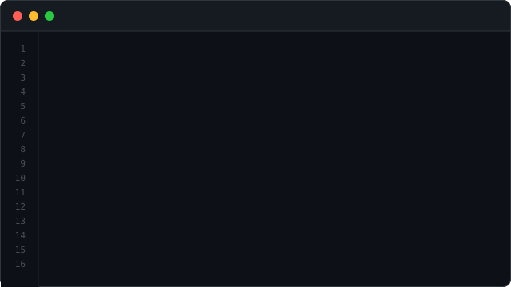

[](https://ibrahim-abdullaziz.vercel.app)

<div align="center">

[](https://ibrahim-abdullaziz.vercel.app)

<br/>

[](https://ibrahim-abdullaziz.vercel.app)
[](https://www.linkedin.com/in/ibrahim-abdullaziz-894035339)
[](mailto:ibrahimabdullaziz55@gmail.com)

<br/>


[](https://github.com/ibrahimabdullaziz)
[](https://github.com/ibrahimabdullaziz)

</div>

<br/>

```bash
~ ibrahimabdullaziz $ cat ibrahim.tsx
```

<div align="center">



</div>

<br/>

```bash
~ ibrahimabdullaziz $ npm install ibrahim
```

```
npm warn deprecated frontend-only@0.0.1
added 1 full-stack engineer in 0.4s

  [✓] react-19              ██████████  expert
  [✓] next-js-14            ████████░░  proficient
  [✓] typescript            █████████░  expert
  [✓] redux-toolkit         ████████░░  proficient
  [✓] tanstack-query        ████████░░  proficient
  [✓] tailwind-v4           ████████░░  proficient
  [~] framer-motion         ██████░░░░  comfortable
  [✓] node-js-express       ██████░░░░  building
  [✓] prisma-orm            ██████░░░░  building
  [~] postgresql            █████░░░░░  advancing
  [ ] docker-ci-cd          ███░░░░░░░  queued
  [✓] c-cpp-foundations     ██████████  strong (yes, really)

info: schema design, transactions, and query planning — loading.
info: backend built from first principles, not just consumed.
```

<br/>

```bash
~ ibrahimabdullaziz $ cat currently.log
```

```
╔══════════════════════════════════════════════════════════════╗
║  ACTIVE PROCESSES                                             ║
╠══════════════════════════════════════════════════════════════╣
║  [PID 001] building   → Nestly (Express + Prisma + Postgres)  ║
║  [PID 002] solving    → NeetCode 150, pattern by pattern (py) ║
║  [PID 003] reading    → OSTEP — Operating Systems (deep)      ║
║  [PID 004] queued     → System Design · Docker · CI/CD        ║
╚══════════════════════════════════════════════════════════════╝
```

<br/>

<div align="center">

<br/>

[](https://github.com/ibrahimabdullaziz)

<br/>

[](https://github.com/ibrahimabdullaziz)

</div>

<br/>

```bash
~ ibrahimabdullaziz $ git log --all --graph
```

<div align="center">

[](https://github.com/ibrahimabdullaziz)

</div>

<br/>

```bash
~ ibrahimabdullaziz $ ./contribution-snake --run
```

<div align="center">

<!--
  Setup note: this snake animation is generated by a GitHub Action, not a static image.
  Add the workflow below at .github/workflows/snake.yml in this profile repo, then
  reference the generated SVG here — see the "snk" action by Platane on GitHub Marketplace.
-->


</div>

<br/>

```bash
~ ibrahimabdullaziz $ cat roadmap.log
```

```
╔══════════════════════════════════════════════════════════════╗
║  MISSION: production-grade full-stack engineer by 2027       ║
╠══════════════════╦═══════════════════════════════╦═══════════╣
║  MODULE          ║  PROGRESS                     ║  STATUS   ║
╠══════════════════╬═══════════════════════════════╬═══════════╣
║  react internals ║  ██████████████████████████░░ ║   90%  ✓  ║
║  next.js / rsc   ║  ████████████████████████░░░░ ║   80%  ✓  ║
║  typescript deep ║  ██████████████████████████░░ ║   90%  ✓  ║
║  prisma + sql    ║  ██████████████░░░░░░░░░░░░░░ ║   45%  ~  ║
║  node.js / apis  ║  ████████████░░░░░░░░░░░░░░░░ ║   40%  ~  ║
║  postgresql      ║  ██████████░░░░░░░░░░░░░░░░░░ ║   35%  ~  ║
║  testing (jest)  ║  ██████░░░░░░░░░░░░░░░░░░░░░░ ║   20%  ↑  ║
║  docker / ci-cd  ║  █████░░░░░░░░░░░░░░░░░░░░░░░ ║   15%  ↓  ║
║  dsa (neetcode)  ║  ████░░░░░░░░░░░░░░░░░░░░░░░░ ║   10%  ↑  ║
╠══════════════════╩═══════════════════════════════╩═══════════╣
║  reading:  OSTEP — Operating Systems: Three Easy Pieces       ║
║  next:     Docker · CI/CD · Redis · System Design             ║
╚══════════════════════════════════════════════════════════════╝
```

<br/>

```bash
~ ibrahimabdullaziz $ ps aux | grep engineer
```

```
USER   PID  STACK                          STATE
ibrahim 001  react + next.js + typescript   RUNNING  (senior-track)
ibrahim 002  node + express + prisma        RUNNING  (leveling-up)
ibrahim 003  postgresql + query-planning    SLEEPING (waking soon)
ibrahim 004  os internals + dsa             BACKGROUND (low-priority, never killed)
```

<br/>

[](https://github.com/ibrahimabdullaziz)
