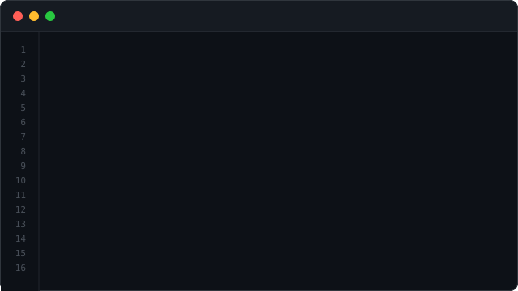

[](https://ibrahim-abdullaziz.vercel.app)

<div align="center">

[](https://ibrahim-abdullaziz.vercel.app)

<br/>

[](https://ibrahim-abdullaziz.vercel.app)
[](https://www.linkedin.com/in/ibrahim-abdullaziz-894035339)
[](mailto:ibrahimabdullaziz55@gmail.com)

<br/>


[](https://github.com/ibrahimabdullaziz)
[](https://github.com/ibrahimabdullaziz)

</div>

<br/>

```bash
~ ibrahimabdullaziz $ cat ibrahim.tsx
```

<div align="center">



</div>

<br/>

```bash
~ ibrahimabdullaziz $ npm install ibrahim
```

```
npm warn deprecated frontend-only@0.0.1
added 1 full-stack engineer in 0.4s

  [✓] react-19              ██████████  expert
  [✓] next-js-14            ████████░░  proficient
  [✓] typescript            █████████░  expert
  [✓] redux-toolkit         ████████░░  proficient
  [✓] tanstack-query        ████████░░  proficient
  [✓] tailwind-v4           ████████░░  proficient
  [~] framer-motion         ██████░░░░  comfortable
  [✓] node-js-express       ████████░░  building
  [✓] prisma-orm            ████████░░  building
  [✓] postgresql            ██████░░░░  advancing
  [✓] docker                ██████░░░░  advancing
  [✓] c-cpp-foundations     ██████████  strong (yes, really)

info: backend built from first principles — auth, transactions, testing, OpenAPI.
info: currently: Shelter API (shipped) → Shelter UI (in progress).
```

<br/>

```bash
~ ibrahimabdullaziz $ cat currently.log
```

```
╔══════════════════════════════════════════════════════════════╗
║  ACTIVE PROCESSES                                             ║
╠══════════════════════════════════════════════════════════════╣
║  [PID 001] shipping   → Shelter UI  (React + TanStack Query)  ║
║  [PID 002] building   → Chess platform  (Socket.io + chess.js)║
║  [PID 003] solving    → NeetCode 150, JS                      ║
║  [PID 004] reading    → OSTEP — Operating Systems             ║
╚══════════════════════════════════════════════════════════════╝
```

<br/>

```bash
~ ibrahimabdullaziz $ git log --all --graph
```

<div align="center">

[](https://github.com/ibrahimabdullaziz)

</div>

<br/>

```bash
~ ibrahimabdullaziz $ git stats --global
```

<div align="center">


</div>

<br/>

```bash
~ ibrahimabdullaziz $ streak --current
```

<div align="center">

[](https://github.com/ibrahimabdullaziz)

</div>

<br/>

<br/>

```bash
~ ibrahimabdullaziz $ ./contribution-snake --run
```

<div align="center">

<!-- Generated by the snk GitHub Action — see .github/workflows/snake.yml -->


</div>

<br/>

```bash
~ ibrahimabdullaziz $ trophy --display
```

<div align="center">

[](https://github.com/ibrahimabdullaziz)

</div>

<br/>

```bash
~ ibrahimabdullaziz $ cat roadmap.log
```

```
╔══════════════════════════════════════════════════════════════╗
║  MISSION: production-grade full-stack engineer by 2027       ║
╠══════════════════╦═══════════════════════════════╦═══════════╣
║  MODULE          ║  PROGRESS                     ║  STATUS   ║
╠══════════════════╬═══════════════════════════════╬═══════════╣
║  react internals ║  ██████████████████████████░░ ║   90%  ✓  ║
║  next.js / rsc   ║  ████████████████████████░░░░ ║   80%  ✓  ║
║  typescript      ║  ██████████████████████████░░ ║   90%  ✓  ║
║  node / express  ║  ████████████████████░░░░░░░░ ║   65%  ✓  ║
║  prisma + sql    ║  ██████████████████░░░░░░░░░░ ║   60%  ✓  ║
║  postgresql      ║  ████████████████░░░░░░░░░░░░ ║   50%  ✓  ║
║  testing         ║  ██████████████░░░░░░░░░░░░░░ ║   45%  ✓  ║
║  docker          ║  ████████████░░░░░░░░░░░░░░░░ ║   40%  ~  ║
║  dsa (neetcode)  ║  ██████░░░░░░░░░░░░░░░░░░░░░░ ║   20%  ↑  ║
║  system design   ║  ████░░░░░░░░░░░░░░░░░░░░░░░░ ║   10%  ↓  ║
╠══════════════════╩═══════════════════════════════╩═══════════╣
║  shipped:  Shelter API — Express · Prisma · PostgreSQL        ║
║  building: Shelter UI · Chess Platform                        ║
║  reading:  OSTEP — Operating Systems: Three Easy Pieces       ║
╚══════════════════════════════════════════════════════════════╝
```

<br/>

[](https://github.com/ibrahimabdullaziz)
